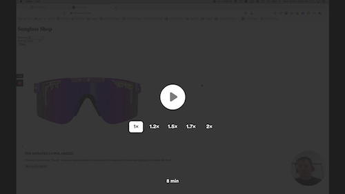
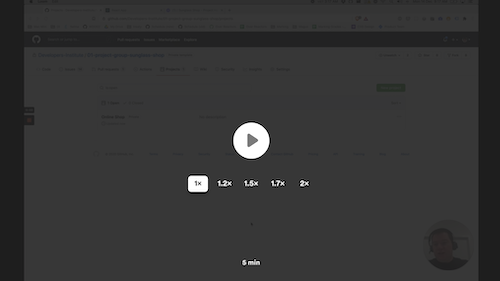
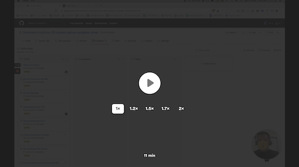

# 01 Project - Online Shop

<details>
  <summary>Group Marking Criteria</summary>
  <br>
  <p>This project has has a group and individual component which will be graded seperately.</p>

  <p>The following Learning Outcomes are assessed using the below criteria:</p>

  <h2>Group Assessment</h2>
  <table>
    <tr>
      <td>LO5</td>
      <td>Install and configure a web-based solution using web scripting</td>
      <td>1 Credit<br />(3.33%)</td>
    </tr>
    <tr>
      <td>LO7</td>
      <td>Write scripts/code that adheres to coding standards to implement and customise a secure solution using frameworks and libraries.</td>
      <td>1 Credit<br />(3.33%)</td>
    </tr>
    <tr>
      <td>LO9</td>
      <td>Optimise client side media for the web, taking into consideration UX, cost, infrastructure requirements and scalability.</td>
      <td>1 Credit<br />(3.33%)</td>
    </tr>
    <tr>
      <td>LO12</td>
      <td>Select, apply and configure plug-in security and compatibility issues; and monitor performance and security.</td>
      <td>1 Credit<br />(3.33%)</td>
    </tr>
    <tr>
      <td>LO19</td>
      <td>Produce intuitive user training material and experiences that are accurate and implemented by both end users and technical staff</td>
      <td>1 Credit<br />(3.33%)</td>
    </tr>
    <tr>
      <td>LO20</td>
      <td>Apply communication, collaboration, teamwork, documentation, customer experience and demonstrate projects using oral and visual presentations</td>
      <td>1 Credit<br />(3.33%)</td>
    </tr>
    <tr>
      <td>LO21</td>
      <td>Apply personal and interpersonal skills to enhance effectiveness in an IT role. </td>
      <td>1 Credit<br />(3.33%)</td>
    </tr>
    <tr>
      <td>LO24</td>
      <td>Apply knowledge of the Treaty of Waitangi into a client-side project</td>
      <td>1 Credit<br />(3.33%)</td>
    </tr>
    <tr>
      <td>LO31</td>
      <td>Demonstrate skills in networking including internet concepts.</td>
      <td>1 Credit<br />(3.33%)</td>
    </tr>
    <tr>
      <td>LO33</td>
      <td>Demonstrate advanced technical knowledge of applications for supporting user requirements.</td>
      <td>1 Credit<br />(3.33%)</td>
    </tr>
    <tr>
      <td colspan="2">
        Total credit weighting counting towards the final grade of WDD01
      </td>
      <td>
        10 Credits<br />(33.33%)
      </td>
    </tr>
  </table>

To receive the LO credits - all summative projects must receive a C- Grade
(50% or higher).

  <table>
    <tr>
      <th>Project Component</th>
      <th>Acceptance criteria</th>
      <th>Component weighting</th>
      <th>Assessment Grade</th>
    </tr>
    <tr>
      <td>Team Formation and The Treaty of Waitangi</td>
      <td>
        Meets the acceptance criteria
      </td>
      <td>5%</td>
      <td></td>
    </tr>
    <tr>
      <td>Design and CSS</td>
      <td>
        Meets the acceptance criteria
      </td>
      <td>15%</td>
      <td></td>
    </tr>
    <tr>
      <td>Stripe integration</td>
      <td>
        Stripe and the Begin API server are setup and integrated into the React Application correctly. Products are fetched from the Begin API. 
      </td>
      <td>20%</td>
      <td></td>
    </tr>
    <tr>
      <td>Deployment</td>
      <td>
        Site is deployed using Netlify
      </td>
      <td>5%</td>
      <td></td>
    </tr>
    <tr>
      <td>Documentation</td>
      <td>
        Readme is created as per the acceptance criteria
      </td>
      <td>5%</td>
      <td></td>
    </tr>
    <tr>
      <td>Code quality</td>
      <td>
        Code looks professional and is formatted in a consistent manner. Code is
        easy to read and understand, with comments and well named functions and
        variables. There is little to no repetition in logic. No
        errors/bugs/syntax problems.
      </td>
      <td>15%</td>
      <td></td>
    </tr>
    <tr>
      <td>Development process</td>
      <td>
        Submitted correctly in GitHub Classrooms. GitHub issues are completed one at a time, and merged into the main branch before the next issue is started. Code is peer-reviewed via Pull Requests. Pull Requests are linked to GitHub issues. Commit messages describe the change made in the commit
      </td>
      <td>15%</td>
      <td></td>
    </tr>
    <tr>
      <td>Group evaluation</td>
      <td>
        Peers in your group will assess your contribution, and this will be allocated to your grade. Note: The final allocation of marks is at the discretion of the examiner.	
      </td>
      <td>20%</td>
      <td></td>
    </tr>
    <tr>
      <th colspan="2" align="left">Total grade</th>
      <td>100%</td>
      <td>/100</td>
    </tr>
  </table>
</details>

<details>
  <summary>Individual Marking Criteria</summary>
  <br>
  <p>This project has has a group and individual component which will be graded seperately.</p>

  <p>The following Learning Outcomes are assessed using the below criteria:</p>

  <h2>Individual assessment</h2>
  <table>
    <tr>
      <td>LO5</td>
      <td>Install and configure a web-based solution using web scripting</td>
      <td>1 Credit<br />(3.33%)</td>
    </tr>
    <tr>
      <td>LO7</td>
      <td>Write scripts/code that adheres to coding standards to implement and customise a secure solution using frameworks and libraries.</td>
      <td>1 Credit<br />(3.33%)</td>
    </tr>
    <tr>
      <td>LO9</td>
      <td>Optimise client side media for the web, taking into consideration UX, cost, infrastructure requirements and scalability.</td>
      <td>1 Credit<br />(3.33%)</td>
    </tr>
    <tr>
      <td>LO11</td>
      <td>Select and apply multiple plug-in solutions.</td>
      <td>1 Credit<br />(3.33%)</td>
    </tr>
    <tr>
      <td>LO12</td>
      <td>Select, apply and configure plug-in security and compatibility issues; and monitor performance and security.</td>
      <td>1 Credit<br />(3.33%)</td>
    </tr>
    <tr>
      <td>LO25</td>
      <td>Apply business concepts in a project including functions, structure and cultural context of business.</td>
      <td>1 Credit<br />(3.33%)</td>
    </tr>
    <tr>
      <td>LO28</td>
      <td>Apply and demonstrate user experience and usability concepts in IT</td>
      <td>1 Credit<br />(3.33%)</td>
    </tr>
    <tr>
      <td>LO32</td>
      <td>Implement hardware and software diagnostic testing,  maintenance, technical and customer support across a range of devices</td>
      <td>1 Credit<br />(3.33%)</td>
    </tr>
    <tr>
      <td>LO34</td>
      <td>Apply security concepts, tools and techniques.</td>
      <td>1 Credit<br />(3.33%)</td>
    </tr>
    <tr>
      <td colspan="2">
        Total credit weighting counting towards the final grade of WDD01
      </td>
      <td>
        9 Credits<br />(30.00%)
      </td>
    </tr>
  </table>

To receive the LO credits - all summative projects must receive a C- Grade
(50% or higher).

  <table>
    <tr>
      <th>Project Component</th>
      <th>Acceptance criteria</th>
      <th>Component weighting</th>
      <th>Assessment Grade</th>
    </tr>
    <tr>
      <td>React Component, design and functionality</td>
      <td>
        React Component and properties are used efficiently. Component demonstrates usable design with CSS. Event handlers are configured correctly. Logical functions are written with appropriate JavaScript and pass unit tests.
      </td>
      <td>50%</td>
      <td></td>
    </tr>
    <tr>
      <td>Code reviews</td>
      <td>
        Performed a code review on a team members pull request, and made a video recording. Followed the code review checklist. Received a code review on a feature that was submitted for code review.
      </td>
      <td>20%</td>
      <td></td>
    </tr>
    <tr>
      <td>Code quality</td>
      <td>
        Code looks professional and is formatted in a consistent manner. Code is
        easy to read and understand, with comments and well named functions and
        variables. There is little to no repetition in logic. No
        errors/bugs/syntax problems.
      </td>
      <td>20%</td>
      <td></td>
    </tr>
    <tr>
      <td>Development process</td>
      <td>
        Submitted correctly by creating a Pull Request, and merging it to the main branch. Commits are frequent, demonstrating progression of development. Clear commit
        messages.
      </td>
      <td>10%</td>
      <td></td>
    </tr>
    <tr>
      <th colspan="2" align="left">Total grade</th>
      <td>100%</td>
      <td>/100</td>
    </tr>
  </table>
</details>

## Brief

Your team has been tasked with completing an eCommerce shop. You will need to set up the shop, create products and integrate your React Application with a third party platform. You also need to complete some new features for the online store.

## Rationale

- Learn how to work in a team on the same product by following industry-standard development practices
- Apply the knowledge you have learnt so far to build a feature for an existing product

## Project handover

Watch the following handover from another developer to your team. This video explains the codebase you will be working in, and where to find the files you will be working on.

<a href="https://www.loom.com/share/e2b4b795b4c3493eb6638e1021b7fba7">
  
  <p>Project handover (8 mins)</p>
</a>

## Your development workflow

### Using GitHub projects

This project will be run using GitHub issues and projects. Watch the following tutorial to understand how to use GitHub projects and where to find the project tasks.

<a href="https://www.loom.com/share/5a8bc195d9cf47389aac6c82eb0d161d">
  
  <p>Using GitHub Projects (5 mins)</p>
</a>

### Development process

Follow the [GitHub Flow](https://guides.github.com/introduction/flow/) when working on this team project.

<a href="https://www.loom.com/share/33612f8d17b54bdaae55a9a3bd54d517">
  
  <p>The development lifecycle aka GitHub Flow (11 mins)</p>
</a>

### Performing a code review

A requirement for this project is that you give and receive a Code Review.

Watch [How to Review Someone Else's Code](https://youtu.be/TlXy_i27N3w) for an introduction on what a code review is, and how to complete one.

<a href="https://youtu.be/TlXy_i27N3w">
  
  <p>How to review someone else's code (8 mins)</p>
</a>

When you have prepared some code that is ready for review, share a [Pull Request](https://docs.github.com/en/free-pro-team@latest/github/collaborating-with-issues-and-pull-requests/proposing-changes-to-your-work-with-pull-requests) with your team and organise someone to review it for you.

---

# Submit your Project

- [ ] Complete each GitHub issue by creating a branch, pull request and merging to the main branch

---

<details>
  <summary>
    Git CLI Refresher
  </summary>

If you need help remembering what commands to type with `git`, use the following as a reference, or watch the [git walkthrough tutorial video](https://vimeo.com/433825571/bc1830fb90)

```shell
# when ready to commit and push
git add .

git commit -m "Completed Part A"

git push origin master
```

</details>
