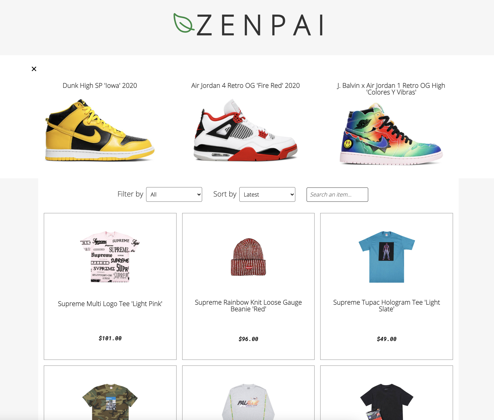

# 01 Project - Online Shop

We have designed an online Sneaker and Apparel store, which includes:

1. A search bar to find the name of the products.
2. A list of featured products cunsumers should be interested in.
3. A list of all the products displayed
4. The Products can be filtered between catergories and sorted from price ranges.

---

The dependencies of the app include the **Stripe API** which we use to hold our products and prices. The store also uses **Begin** to deploy the staging environment of the website.

---

**How to use the app for development:**

---

Before you can run the application type the following into your VS code terminal:

_npm install && npm start_

---

This should install all the nessessary packages and open up a local test environment where you can see the store in action.

Link to website:https://suspicious-poitras-f0bb60.netlify.app

Link to Begin: https://light-w0z-staging.begin.app/products

[View the project instructions](PROJECT-INSTRUCTIONS.md)
